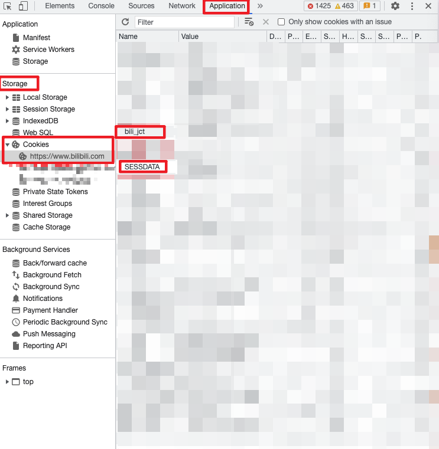

# Bili Welcome

## 安装

```bash
npm install -g bili-welcome
```

## 参数

| 参数 | 简写 | 说明 | 备注 |
| --- |:-: | --- | --- |
| --config | -c | 配置文件路径 | 默认为 `config.json` |
| --debug | -d | 开启调试模式 | |
| --no-response | -R | 关闭自动回复 | 默认启用自动回复 |
| --csrf | | cookie 中的 `bili_jct` 用作 `csrf` | |
| --sess | | cookie 中的 `SESSDATA` 用作 `sess` | |
| --roomId | | 直播间号 | 必须为整数 |

```bash
bwel -c "./config/config.json" -d -R --csrf 1234 --sess 5678 --roomId 4321
```

## 配置

当前有两种配置方案：手动配置与自动配置。

### 自动配置

如果配置文件中没有指定，也没有在调用命令时传入 `csrf` 和 `sess`，并且启用了自动回复（默认行为），则会自动尝试登录获取。

```bash
bwel
```

> ℹ 自动回复已启用，但 csrf 与 sess 未指定。尝试使用二维码登录
>
> ℹ 请使用手机 app 扫描二维码登录

扫码完成并在手机上确认登陆后即可自动获取 `csrf` 和 `sess`。配置会自动写入全局配置文件中。

注意，自动配置不会自动获取 `roomId`，需要手动指定。

### 手动配置

可以通过命令行或者配置文件来配置。首先需要获取到 `csrf` 和 `sess`，可以通过浏览器的开发者工具来获取。

打开开发工具后，进入 `Application`，左侧选择 `Storage` 里的 `Cookies`，找到 `bili_jct` 和 `SESSDATA`，将其值填入配置文件或命令行参数中。



`bili_jct` 对应 `csrf`，`SESSDATA` 对应 `sess`。

### 配置文件

配置文件包括全局配置以及命令指定配置。

在 `Windows` 系统中，全局配置文件位于 `%LOCALAPPDATA%\bili-welcome\config.json` 文件，`macOS` 与 `Linux` 会读取 `~/.config/bili-welcome/config.json` 文件。如果不存在则会创建并写入空配置。

默认读取当前目录下的 `config.json` 文件，如果不存在则使用命令行参数。

也可以通过 `--config <path>` 或 `-c <path>` 来指定配置文件路径。

具体格式为：

```typescript
type Config = {
    csrf: string;
    sess: string;
    roomId: number;
}
```

```json
{
    "csrf": "1234",
    "sess": "5678",
    "roomId": 4321
}
```

### 命令行

```bash
bwel --csrf=1234 --sess=5678 --roomId=4321
```

可以通过 `--debug` 或 `-d` 进入调试模式，调试模式下会输出更多信息。

注意，命令行指定的配置文件会覆盖全局配置文件中的参数，而通过命令行指定 `roomId`，`sess` 与 `csrf` 参数则具有最高的优先级。
